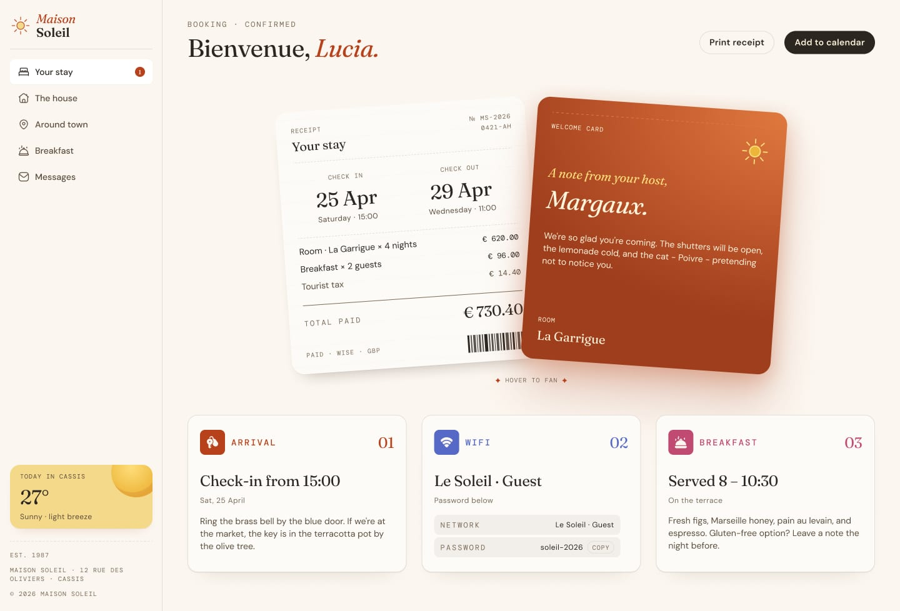

# Frontend Mentor - Hotel booking confirmation page solution

This is a solution to the [Hotel booking confirmation page challenge on Frontend Mentor](https://www.frontendmentor.io/challenges/hotel-booking-confirmation-page). Frontend Mentor challenges help you improve your coding skills by building realistic projects.

## Table of contents

- [Overview](#overview)
  - [The challenge](#the-challenge)
  - [Screenshot](#screenshot)
  - [Links](#links)
- [My process](#my-process)
  - [Built with](#built-with)
  - [What I learned](#what-i-learned)
  - [Continued development](#continued-development)
  - [AI Collaboration](#ai-collaboration)
- [Author](#author)

## Overview

### The challenge

Users should be able to:

- View the optimal layout for the interface depending on their device's screen size
- See hover and focus states for all interactive elements on the page
- Open and close the navigation menu on smaller screens
- Copy the Wi-Fi password to their clipboard using the copy button

### Screenshot



### Links

- Solution URL: [Add your repo URL here](https://your-solution-url.com)
- Live Site URL: [Add your deployed URL here](https://your-live-site-url.com)

## My process

### Built with

- Semantic HTML5 markup
- Tailwind CSS (utility classes, compiled via the Tailwind CLI to `output.css`)
- CSS Grid for the three-column guest info row
- Flexbox for the sidebar, header, and card layouts
- Mobile-first responsive workflow, with a single `lg:` (1024px) breakpoint switching between the stacked mobile layout and the sidebar desktop layout
- Self-hosted variable fonts (Fraunces, DM Sans, DM Mono) via `@font-face`
- Vanilla JavaScript for all interactive behaviour (no framework/build step beyond Tailwind)

### What I learned

The main challenge was the overlapping receipt/host-note cards. On mobile the note card sits *above* the receipt in normal document flow, but on desktop the receipt sits behind, offset to the left, with the note overlapping in front and both cards slightly rotated. I handled the reordering with `flex-col-reverse` (so the note, coming second in the DOM, renders first on mobile) and then switched to `lg:absolute` positioning with rotation and `z-index` at the desktop breakpoint, so the same two elements serve both layouts without duplicating markup:

```html
<div class="group/cards flex flex-col-reverse gap-6 lg:block lg:relative lg:h-[460px]">
  <article class="... lg:absolute lg:left-0 lg:top-6 lg:-rotate-2">…receipt…</article>
  <article class="... lg:absolute lg:left-[380px] lg:top-0 lg:rotate-2">…note…</article>
</div>
```

A `group-hover` transform on each card (rotating a little further apart on hover) gave the "hover to fan" effect called out in the design without any JavaScript.

I also learned to double-check a rendering tool's own limitations before trusting it: the headless renderer I used to preview my work in the sandbox is built on an old WebKit engine that doesn't understand modern `hsl(h s% l% / alpha)` colour syntax or CSS custom properties, so a few elements appeared to have no background in my screenshots even though the compiled CSS was correct. Cross-checking the generated `output.css` directly (rather than trusting the screenshot alone) confirmed the utility classes were present and correct.

### Continued development

- Swap the hardcoded booking details for data loaded from a small JSON file, as suggested in the challenge extensions
- Add a tablet-specific breakpoint rather than jumping straight from the mobile stack to the full desktop sidebar at 1024px
- Revisit color-contrast on the muted neutral-600 text against the neutral-100 background against WCAG AA at small sizes

### AI Collaboration

- **Tool used:** Claude (Anthropic), in the Claude.ai chat interface with file/code execution tools.
- **How it was used:** I uploaded the Frontend Mentor starter files (design JPGs, style guide, assets) and asked Claude to build out the full solution directly — HTML structure, Tailwind config/theme tokens, `@font-face` setup, and the vanilla JS for the mobile menu, Wi-Fi password copy button, print-receipt action, and an "Add to calendar" `.ics` download. Claude read the design screenshots and `style-guide.md` to match colors, type, and spacing, compiled the CSS with the Tailwind CLI, and used a headless rendering tool to sanity-check the layout against the source designs before handing off the files.
- **What worked well:** Having Claude read the actual `style-guide.md` values instead of eyeballing colors from the JPGs avoided drift from the spec. Generating the CSS and then grepping the compiled output was a reliable way to confirm classes existed even when the preview screenshots looked wrong.
- **What didn't:** The sandbox's screenshot tool (an old WebKit build) couldn't render CSS Grid or the modern `hsl(... / var(...))` opacity syntax Tailwind generates by default, so some elements looked broken in preview despite correct code — worth remembering that a rendering tool's own limitations can be mistaken for bugs.

## Author

- Brand - GentleWhiz
- Frontend Mentor - [@yourusername](https://www.frontendmentor.io/profile/@Gentlewhiz)
